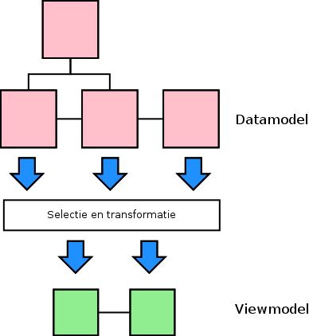
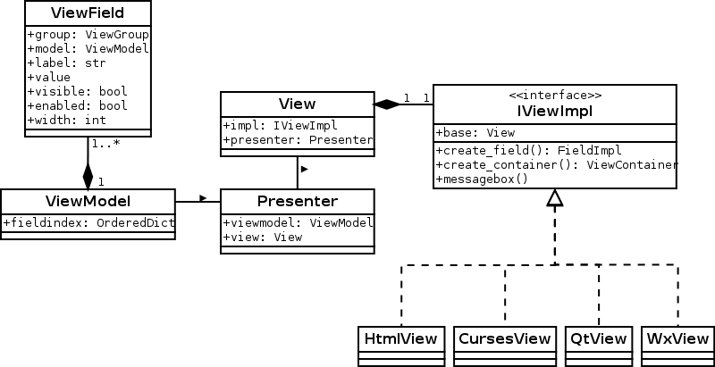

# Introductie

Py-mvp is een Python Model View Presenter framework met WxPython, PySide, HTML5 en curses frontends

## Model
In Py-mvp is het model uitgesplitst in een datamodel en een viewmodel. De gedachte daarachter is dat
er vaak niet een 1-op-1 mapping is van het datamodel naar de view. Het viewmodel lost dit probleem op.

[Hier een plaatje van verschillende views op data]

### Datamodel
Het datamodel of domeinmodel is een representatie van entiteiten uit het probleemdomein van de applicatie.
De regels die samen de business logica vormen liggen worden vastgelegd in het datamodel.

### Viewmodel
Er is vaak behoefte aan meerdere views op data uit het probleemdomein. Een viewmodel is de datarepresentatie van
zo'n view. Een viewmodel wordt gemaakt door een selectie te maken uit het domeinmodel en deze selectie eventueel
te transformeren.

Het viewmodel is de databuffer van de view. Alles wat in een view wordt ingevoerd wordt in een viewmodel
opgeslagen. De invoerelementen in de view worden gevuld vanuit een viewmodel. De presenter zorgt voor de
koppeling tussen het viewmodel en één of meerdere datamodellen.

Het viewmodel helpt bij het implementatie/toolkit onafhankelijk maken van een view

## View
Een view is de visuele representatie van een viewmodel. De relatie tussen de view en het viewmodel is
altijd 1:1, terwijl de relatie tussen het datamodel en viewmodel vaak n:n is.

In py-mvp bestaat een view altijd uit een abstracte instantie van klasse View en een concrete, toolkit
afhankelijke implementatie. De implementatie implementeert de (denkbeeldige) interface IViewImpl
en is in de view beschikbaar als property "impl".

Het is belangrijk de view zo dom mogelijk te houden. Dat vergroot de testbaarheid en vergemakkelijkt
het ondersteunen van meerdere GUI toolkits. Events uit invoerelementen worden niet door de view
afgehandeld maar doorgegeven aan de presenter. Updates van de view worden aangestuurd door de presenter.

## Presenter
De presenter bestuurt de view, handelt view events af en wisselt gegevens uit tussen het datamodel
en het viewmodel.

## Class diagram

